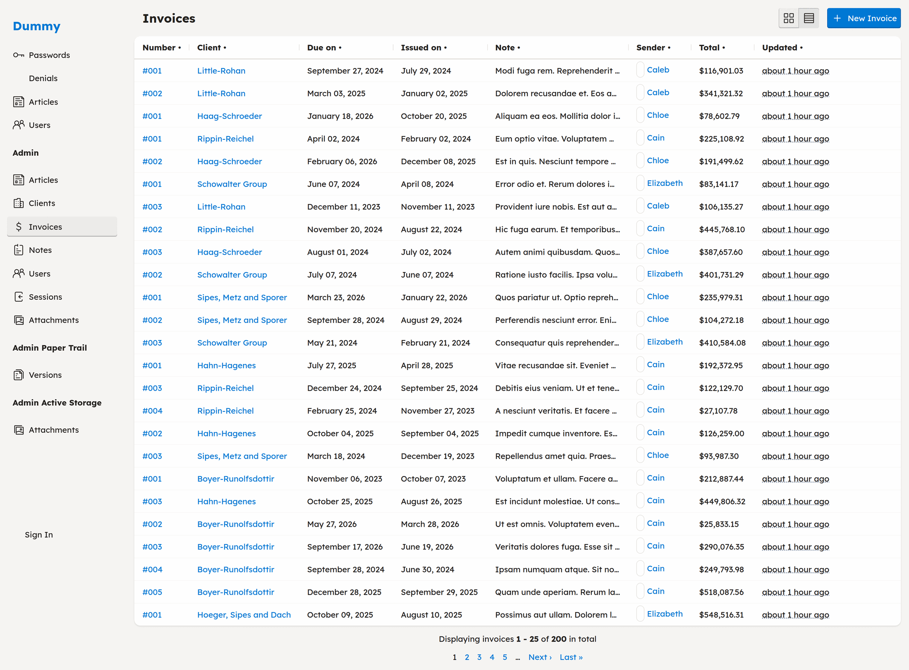

# CafeCar

[](https://github.com/craft-concept/cafe_car/actions/workflows/ci.yml)
[](https://rubygems.org/gems/cafe_car)
[](https://opensource.org/licenses/MIT)

> 🚀 **[Live demo →](https://cafe-car-demo.up.railway.app)** — a back-office
> rendered from plain models (clients, invoices, articles, users, notes).
> No signup; the data resets periodically.

**CafeCar is a composable view extension for Rails** — presenters that format any
value, a form builder that renders typed fields from the schema, UI components,
Pundit policies that drive what renders, and a query grammar on every model. Use
each piece wherever it deletes view code, customer-facing pages as much as the
back office.

The pieces also compose all the way up: one line of controller code renders index,
show, new, and edit straight from the model, with authorization, filtering, keyword
search, sorting, pagination, CSV export, and Hotwire-ready forms. Every default can
be overridden application-wide or per model.

<p align="center">
  <a href="https://cafe-car-demo.up.railway.app/admin/invoices">
    
  </a>
</p>
<p align="center">
  <em>A complete admin index — sortable columns, formatted values, association links, and
  pagination — rendered from a model with one line of controller code.
  <a href="https://cafe-car-demo.up.railway.app">Try the live demo →</a></em>
</p>

**Using ViewComponent or Phlex?** They pick the unit of reuse for the UI you
write; CafeCar renders the CRUD boilerplate you'd otherwise hand-write. They
sit at different layers and compose — keep your components for the screens you
customize and drop them into a CafeCar view like any other partial.

## Install

```ruby
# Gemfile
gem "cafe_car"
```

```bash
$ bundle install
$ rails generate cafe_car:install
```

## The pieces, on any page

The installer includes `CafeCar::Controller` in `ApplicationController`, so the
presenters and form builder work in every view — no `cafe_car` macro required:

```erb
<%# a customer-facing page — before, and after %>
<p>Total <%= number_to_currency(@order.total) %></p>
<p>Total <%= present(@order.total, as: :currency) %></p>

<%= form_with model: @review do |f| %>
  <%= f.field :rating %>
  <%= f.field :body %>
  <%= f.submit %>
<% end %>
```

## One line to a working admin

```ruby
class ProductsController < ApplicationController
  cafe_car
end
```

When a resource deserves the full CRUD surface, that single line gives you all seven
RESTful actions, Pundit authorization, filtering, keyword search, sorting, pagination,
CSV export, and JSON / HTML / Turbo Stream responses. Or scaffold a complete resource
at once:

```bash
$ rails generate cafe_car:resource Product name:string price:decimal description:text
```

## Learn more

- **[Guide](guide/)** — the reference, page by page: controllers, views, policies, presenters, forms, filtering, navigation, components, locales, Turbo.
- **[README & full usage guide](https://github.com/craft-concept/cafe_car#readme)** — controllers, policies, presenters, components, forms, filtering.
- **[Changelog](https://github.com/craft-concept/cafe_car/blob/main/CHANGELOG.md)**
- **[Contributing](https://github.com/craft-concept/cafe_car/blob/main/CONTRIBUTING.md)** · **[Security policy](https://github.com/craft-concept/cafe_car/blob/main/SECURITY.md)**
- **[Source on GitHub](https://github.com/craft-concept/cafe_car)**

---

<small>Released under the [MIT License](https://opensource.org/licenses/MIT).</small>
